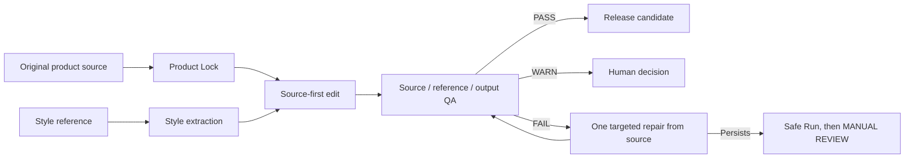

# Product Photo AI Workflows

**Reusable, platform-native workflows for faithful AI product photo editing.**

Turn a photographed flat-lay or tabletop product into a controlled new background while protecting the product details your customer actually buys: shape, construction, color, texture, components, and identity.

[Tiếng Việt](README.vi.md) · [5-minute quickstart](QUICKSTART.md) · [Quickstart tiếng Việt](QUICKSTART.vi.md) · [Manual test policy](tests/manual-test-matrix.md)

This is an open, modular workflow kit for the consumer interfaces of ChatGPT, Gemini, and Claude. It does not require an API, a local image server, or strict filenames. Use it once by pasting an Instant Run prompt, or install it as a reusable Custom GPT, Gem, or Claude Project.

> Version 1 is deliberately focused: flat-lay and tabletop garments, fabric, earrings, bracelets, and reflective accessories. It is not an on-model or ghost-mannequin workflow.

## Why ordinary background replacement fails

“Replace the background with something like this reference” sounds simple. For commercial product photography, it is not.

An image model may quietly redraw the whole scene. A collar becomes more symmetrical. Natural folds are smoothed. Seams disappear. A textile repeat shifts. White fabric adopts the sage background color. Stones, prongs, chain links, or clasps multiply. Reflections stop matching the metal. A logo or caption from the reference appears in the output. The image may look polished while no longer representing the item being sold.

That difference matters to a buyer, a merchandiser, and a brand. Product editing is not generic beautification; it is a controlled transformation with an evidence-based release decision.

This repository separates five concerns that are commonly mixed inside one long prompt:

- **Product Lock** defines what cannot change.
- **Product Modules** add category-specific risks and inspection rules.
- **Style Cards** describe the transferable background and light treatment.
- **Output Profiles** define ecommerce or social composition boundaries.
- **Platform Packages** adapt the same workflow to the controls and limitations of each interface.

The result is easier to repeat across a catalog, review across a team, and extend without rewriting everything.

## Who this is for

This kit is written for people responsible for commercial images, including:

- independent sellers and fashion brands preparing frequent product drops;
- jewelry businesses that need stones, settings, clasps, metal color, and reflections to survive an edit;
- ecommerce teams standardizing a catalog across product categories;
- creative studios producing campaign and marketplace variants for clients;
- photographers and retouchers who want AI assistance with explicit review gates;
- organizations that need a documented workflow rather than an undocumented “good prompt.”

You do not need to write code. A small Python test suite exists for contributors and maintainers, but daily users work in their chosen AI interface.

## How the workflow protects your product

The original product photo remains authoritative. The reference is allowed to contribute surface, palette, lighting, contact shadow, mood, and compatible spacing—but never its product, props, people, packaging, typography, logos, or watermarks.



The precedence is fixed: Product Lock → original source → Product Module → Output Profile → Style Card/reference → non-conflicting user requests.

Two run modes support different risk levels:

- `SAFE RUN` shows **Product detected**, **Locked**, **Style extracted**, **Excluded from reference**, and **Risks**, then waits for `CONTINUE`.
- `FAST RUN` performs the same analysis internally but pauses when roles, critical details, geometry, exact color, or platform capability are ambiguous.

Every output receives `PASS`, `WARN`, `FAIL`, or `MANUAL REVIEW`. Repairs return to the original source; a generated output never becomes the new product source. Product fidelity is not guaranteed by AI, so human inspection remains part of the workflow.

## Quick start

For the shortest complete guide, open [QUICKSTART.md](QUICKSTART.md).

The basic conversation is:

1. Choose ChatGPT, Gemini, or Claude.
2. Paste that platform's `instant-run.md`, or install its reusable package once.
3. Upload the reference with: **“Use this image as the style reference only.”**
4. Upload a target with: **“This is the original product source. Replace only its background.”**
5. Send `SAFE RUN ECOMMERCE` for a careful first attempt or `FAST RUN SOCIAL` for a familiar batch.
6. In Safe Run, review the lock sheet and reply `CONTINUE`.
7. Inspect the returned image beside the source. Accept the QA status, send one targeted repair command, or use `NEXT PRODUCT`.

Ordinary filenames are fine. If several unlabeled images arrive together, the workflow proposes roles using observable features and asks you to confirm before editing—without fake confidence percentages.

## Choose your platform

The packages share core behavior but do not claim that different image models produce equivalent results.

| Platform | Instant Run | Install once | Capability note |
|---|---|---|---|
| ChatGPT | [Copy-paste prompt](platforms/chatgpt/instant-run.md) | [Custom GPT setup](platforms/chatgpt/setup.md) | Supports uploaded-image editing where ChatGPT Images is available; selections can affect more than the marked area. |
| Gemini | [Copy-paste prompt](platforms/gemini/instant-run.md) | [Custom Gem setup](platforms/gemini/setup.md) | Supports uploaded and multi-image editing on eligible surfaces; availability varies by account, age, country, language, and plan. |
| Claude | [Capability-aware prompt](platforms/claude/instant-run.md) | [Claude Project setup](platforms/claude/setup.md) | Must check the current interface. If raster editing is absent, it completes analysis and render-brief stages only and labels them honestly. |

Read each package's `limitations.md` before using it for production work. Claude does not automatically export a prompt or redirect the user to another platform in Version 1.

## Product and style coverage

Product Modules focus QA on the details most likely to drift.

| Product Module | Locks and review emphasis |
|---|---|
| [Garments](products/garments.md) | Silhouette, folds, seams, collars, sleeves, closures, labels, pattern repetition, textile texture, and color. |
| [Fabric](products/fabric.md) | Cut edges, weave or knit, pile, translucency, drape, fold placement, pattern scale and repeat. |
| [Earrings](products/earrings.md) | Pairing, posts, hooks, clasps, stones, prongs, spacing, finish, transparency, and reflections. |
| [Bracelets](products/bracelets.md) | Circumference, band or chain geometry, links, charms, spacing, clasp, stones, finish, and reflections. |
| [Reflective accessories](products/reflective-accessories.md) | Geometry, engraving, polished edges, metal color, transparency, highlights, and plausible environmental reflections. |

Style Cards describe transferable treatment. They never authorize a product change.

| Style Card | Visual direction | Recommended use |
|---|---|---|
| [Sage Minimal Flat Lay](styles/sage-minimal-flatlay.md) | Pale desaturated sage, paper-like grain, soft upper-left light, restrained editorial mood. | Apparel, textiles, and light jewelry. |
| [Clean White Studio](styles/clean-white-studio.md) | Neutral white-to-light-gray plane, broad soft light, clean commercial grounding. | All initial categories. |
| [Warm Beige Editorial](styles/warm-beige-editorial.md) | Warm matte surface, gentle directional light, tactile fashion mood. | Apparel, textiles, earrings, and bracelets. |
| [Dark Luxury Jewelry](styles/dark-luxury-jewelry.md) | Charcoal-to-black surface, controlled specular highlights, realistic reflections. | Jewelry and reflective accessories. |

Choose [Ecommerce](outputs/ecommerce.md) for faithful catalog presentation, restrained styling, no props, and a target of approximately 15% clear padding when feasible. Choose [Social](outputs/social.md) for stronger background mood and negative space; Product Lock remains mandatory and props are opt-in. For a new ratio, both profiles expand background first and never crop or distort the product.

## Examples

The [Sage Minimal Flat Lay example](examples/sage-minimal-flatlay/README.md) currently demonstrates the documentation contract: assembled brief, Safe Run lock sheet, and QA report for a clearly labeled synthetic bracelet control.

It intentionally contains no unlicensed image and no fabricated successful generation. An image enters the repository only after its creator, source or generation record, and redistribution license are documented. Synthetic transparent cutouts are useful for edge and shadow controls, but they do not replace real photographed-source tests.

## Use in a business workflow

For repeated catalog work, treat the workflow as a quality system rather than a one-click filter:

1. **Calibrate.** Select representative difficult products, one approved style, and one output profile. Start in Safe Run.
2. **Approve the lock language.** A merchandiser, photographer, or product owner confirms which details are commercially critical.
3. **Pilot each platform surface.** Record model/interface, date, source type, status, and evidence in the [manual matrix](tests/manual-test-matrix.md). Never transfer a PASS between platforms.
4. **Batch carefully.** Reuse style and output settings, then send `NEXT PRODUCT` so each source gets a fresh Product Lock.
5. **Review at useful zoom.** Compare source and output for silhouette, folds, seams, texture, color, text, stones, clasps, edges, transparency, highlights, and reflections.
6. **Bound repairs.** Make one category-specific repair from source. If it persists, Safe Run from source; then `MANUAL REVIEW` or conventional retouching.
7. **Archive evidence.** Keep the approved source, reference, output, lock sheet, QA status, platform, and test date together according to your organization's retention policy.

Privacy and rights matter. Before uploading client products, unreleased collections, personal information, or proprietary imagery, review the AI provider's current data controls, storage behavior, workspace policy, and contractual terms. Use an approved business workspace when your organization requires it. Do not upload an image merely because it is visible online; confirm permission for the edit and any intended redistribution.

AI output still requires a commercial decision. This repository does not promise perfect results, exact color measurement, legal clearance, marketplace acceptance, or identical output across platforms.

## Extend the library

The library is designed as a set of modules, not one monolithic prompt.

- Copy `products/_template.md` to add a category-specific Product Module.
- Copy `styles/_template.md` to add a reusable background treatment.
- Copy `outputs/_template.md` to add a channel or campaign Output Profile.
- Give the module a unique lowercase kebab-case `id`, semantic version, compatible platforms, recommended products, outputs, and every required section.
- Run the automated tests and repository validator, then record honest visual evidence on the platforms you actually tested.

Core changes affect every platform and require stricter review than adding a Style Card. Roadmap items such as ghost mannequin, on-model editing, and an optional user-triggered prompt exporter need separate specifications; they are not implied by Version 1.

## Contributing and license

Contributions are welcome from photographers, retouchers, fashion and jewelry teams, prompt designers, accessibility reviewers, and developers. Useful contributions include new Product Modules, carefully scoped Style Cards, stronger QA cases, platform limitation updates, translations, and rights-cleared examples.

Before proposing a change, run:

```bash
python -m pytest -v
python tools/validate_templates.py .
```

Never invent visual test results, and never add an image without documented redistribution rights. The project is released under the MIT License; image assets may carry their own compatible notices and must be documented individually.
