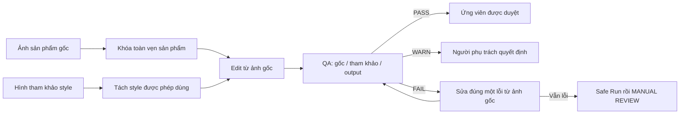

# Product Photo AI Workflows

**Bộ workflow tái sử dụng ngay trong từng nền tảng, giúp chỉnh ảnh sản phẩm bằng AI mà vẫn ưu tiên Độ trung thực sản phẩm.**

Thay nền cho ảnh flat-lay hoặc tabletop theo cách có kiểm soát, đồng thời bảo vệ những gì khách hàng thật sự mua: phom dáng, cấu tạo, màu sắc, chất liệu, linh kiện và dấu hiệu nhận diện của chính sản phẩm.

[English](README.md) · [Bắt đầu trong 5 phút](QUICKSTART.md) · [Quy tắc kiểm thử thủ công](tests/manual-test-matrix.md)

Đây là một bộ workflow mở, dạng module, dùng trực tiếp trong giao diện ChatGPT, Gemini và Claude. Bạn không cần API, không cần server chứa ảnh, cũng không phải đổi tên file theo một quy tắc rườm rà. Có thể dùng ngay bằng cách dán prompt Instant Run, hoặc cài một lần thành Custom GPT, Gem hay Claude Project để xử lý lặp lại.

> Phiên bản 1 chủ động giới hạn vào sản phẩm flat-lay và tabletop: quần áo, vải, hoa tai, vòng tay và phụ kiện có bề mặt phản chiếu. Chưa bao gồm ảnh người mẫu hoặc ghost mannequin.

## Vì sao yêu cầu “thay nền” thông thường hay thất bại

“Hãy thay nền giống hình tham khảo này” nghe rất đơn giản. Nhưng với hình ảnh dùng để bán hàng, đây không chỉ là bài toán làm cho đẹp.

AI có thể âm thầm vẽ lại cả cảnh: cổ áo cân hơn nhưng sai hàng thật; nếp gấp tự nhiên bị làm mượt; đường may biến mất; họa tiết vải bị lệch nhịp; áo trắng nhiễm màu xanh của nền; số viên đá, chấu giữ đá, mắt xích hoặc khóa vòng thay đổi; Vùng bắt sáng bề mặt không còn đúng với kim loại; chữ, logo hay đạo cụ trong hình tham khảo xuất hiện ngoài ý muốn. Ảnh có thể trông bắt mắt nhưng không còn mô tả đúng sản phẩm đang bán.

Đó là rủi ro thương mại, không chỉ là lỗi thẩm mỹ. Product Photo AI Workflows tách một prompt dài thành năm lớp có trách nhiệm rõ ràng:

- **Khóa toàn vẹn sản phẩm (Product Lock)** xác định những gì tuyệt đối không được thay đổi.
- **Product Module** bổ sung rủi ro và tiêu chí kiểm tra riêng cho từng loại hàng.
- **Style Card** chỉ mô tả nền, ánh sáng và cảm giác hình ảnh có thể chuyển giao.
- **Output Profile** quy định giới hạn bố cục cho ecommerce hoặc social.
- **Platform Package** chuyển cùng một workflow sang đúng cách dùng và giới hạn của từng giao diện.

Nhờ vậy, một cá nhân có thể làm ảnh đều tay hơn, còn một tổ chức có thể review, huấn luyện và mở rộng quy trình mà không phải viết lại từ đầu.

## Bộ này dành cho ai

- Người bán hàng độc lập và thương hiệu thời trang ra mắt nhiều sản phẩm theo đợt.
- Doanh nghiệp trang sức cần giữ đúng viên đá, chấu, khóa, màu kim loại và vùng phản chiếu.
- Đội ecommerce cần chuẩn hóa catalog qua nhiều loại sản phẩm.
- Studio sáng tạo làm ảnh marketplace và campaign cho khách hàng.
- Nhiếp ảnh gia, retoucher muốn tận dụng AI nhưng vẫn có bước duyệt rõ ràng.
- Tổ chức cần một quy trình có thể bàn giao, thay vì phụ thuộc vào “một prompt hay” của riêng một người.

Người dùng hằng ngày không cần biết lập trình. Python và test suite chỉ phục vụ người đóng góp, người duy trì repo và quy trình release.

## Workflow bảo vệ sản phẩm như thế nào

Ảnh chụp sản phẩm gốc luôn là nguồn có thẩm quyền về sản phẩm. Hình tham khảo chỉ được cung cấp bề mặt nền, bảng màu, hướng và độ mềm của ánh sáng, Bóng tiếp xúc, mood và khoảng trống tương thích. Tuyệt đối không lấy sản phẩm, đạo cụ, người, bao bì, chữ, logo hay watermark từ hình tham khảo.



Thứ tự ưu tiên cố định là: Product Lock → ảnh sản phẩm gốc → Product Module → Output Profile → Style Card/hình tham khảo → yêu cầu khác không xung đột.

Hai chế độ phù hợp với hai mức rủi ro:

- `SAFE RUN` hiển thị **Product detected**, **Locked**, **Style extracted**, **Excluded from reference** và **Risks**, sau đó chờ `CONTINUE`.
- `FAST RUN` vẫn làm đủ phân tích ở bên trong, nhưng phải dừng nếu vai trò ảnh, chi tiết quan trọng, hình học, màu chính xác hay khả năng của nền tảng chưa rõ.

Sau khi tạo ảnh, workflow trả về `PASS`, `WARN`, `FAIL` hoặc `MANUAL REVIEW`. Mọi lần sửa đều quay về ảnh gốc; không dùng output do AI sinh ra làm nguồn sản phẩm mới. AI không đảm bảo Độ trung thực sản phẩm, vì vậy kiểm tra của con người vẫn là một phần bắt buộc.

## Bắt đầu nhanh

Xem hướng dẫn ngắn nhất tại [QUICKSTART.md](QUICKSTART.md).

Quy trình hội thoại cơ bản:

1. Chọn ChatGPT, Gemini hoặc Claude.
2. Dán file `instant-run.md` của nền tảng, hoặc cài package một lần.
3. Gửi hình tham khảo kèm câu: **“Use this image as the style reference only.”**
4. Gửi ảnh cần sửa kèm câu: **“This is the original product source. Replace only its background.”**
5. Lần đầu nên dùng `SAFE RUN ECOMMERCE`; khi setup đã quen có thể dùng `FAST RUN SOCIAL`.
6. Với Safe Run, đọc lock sheet rồi mới trả lời `CONTINUE`.
7. Đặt ảnh gốc và output cạnh nhau để kiểm tra. Chấp nhận kết quả QA, dùng một lệnh `REPAIR ...`, hoặc chuyển sang `NEXT PRODUCT`.

Tên file bình thường là đủ. Nếu nhiều ảnh không có nhãn được gửi cùng lúc, workflow sẽ mô tả đặc điểm quan sát được, đề xuất vai trò và bắt buộc bạn xác nhận trước khi edit; không bịa phần trăm tự tin.

## Chọn nền tảng

Ba package dùng chung lõi nhưng không tuyên bố các model sẽ tạo kết quả tương đương.

| Nền tảng | Dùng ngay | Cài một lần | Ghi chú về khả năng |
|---|---|---|---|
| ChatGPT | [Prompt copy-paste](platforms/chatgpt/instant-run.md) | [Cài Custom GPT](platforms/chatgpt/setup.md) | Có thể edit ảnh upload khi ChatGPT Images khả dụng; vùng chọn không phải mask tuyệt đối. |
| Gemini | [Prompt copy-paste](platforms/gemini/instant-run.md) | [Cài Gem](platforms/gemini/setup.md) | Có thể hỗ trợ upload nhiều ảnh và edit trên giao diện đủ điều kiện; phụ thuộc tuổi, tài khoản, quốc gia, ngôn ngữ và plan. |
| Claude | [Prompt nhận biết capability](platforms/claude/instant-run.md) | [Cài Claude Project](platforms/claude/setup.md) | Phải kiểm tra tool của giao diện hiện tại. Nếu không có raster edit, Claude chỉ hoàn tất phân tích và render brief, không giả vờ đã tạo ảnh. |

Hãy đọc `limitations.md` của từng package trước khi đưa vào sản xuất. Phiên bản 1 không tự động xuất prompt hoặc chuyển người dùng từ Claude sang nền tảng khác.

## Phạm vi sản phẩm và style

Product Module giúp QA tập trung vào những chi tiết dễ bị AI làm sai nhất.

| Product Module | Nội dung cần khóa và kiểm tra |
|---|---|
| [Garments](products/garments.md) | Phom dáng và đường biên sản phẩm, nếp gấp, đường may, cổ, tay, nút/khóa, nhãn, nhịp họa tiết, texture và màu. |
| [Fabric](products/fabric.md) | Mép cắt, sợi dệt/đan, lông bề mặt, độ trong, độ rủ, vị trí nếp gấp, tỷ lệ và nhịp lặp họa tiết. |
| [Earrings](products/earrings.md) | Số lượng/cặp, chốt, móc, khóa, viên đá, chấu, khoảng cách, màu và hoàn thiện kim loại, độ trong, phản chiếu. |
| [Bracelets](products/bracelets.md) | Chu vi, hình học vòng hoặc dây, mắt xích, charm, khoảng cách, khóa, đá, màu kim loại và phản chiếu. |
| [Reflective accessories](products/reflective-accessories.md) | Hình học, khắc chữ, cạnh đánh bóng, màu kim loại, độ trong, Vùng bắt sáng bề mặt và phản chiếu môi trường hợp lý. |

Style Card chỉ mô tả cách xử lý thị giác được phép chuyển sang nền mới.

| Style Card | Hướng hình ảnh | Phù hợp |
|---|---|---|
| [Sage Minimal Flat Lay](styles/sage-minimal-flatlay.md) | Xanh sage nhạt, giảm bão hòa; grain như giấy; ánh sáng mềm từ trên trái. | Quần áo, vải và trang sức sáng. |
| [Clean White Studio](styles/clean-white-studio.md) | Nền trắng đến xám nhạt trung tính; nguồn sáng rộng; Bóng tiếp xúc sạch. | Toàn bộ nhóm sản phẩm ban đầu. |
| [Warm Beige Editorial](styles/warm-beige-editorial.md) | Bề mặt beige ấm, ánh sáng có hướng nhẹ, cảm giác fashion editorial giàu chất liệu. | Quần áo, vải, hoa tai, vòng tay. |
| [Dark Luxury Jewelry](styles/dark-luxury-jewelry.md) | Than đến đen, kiểm soát highlight và phản chiếu, cảm giác trang sức cao cấp. | Trang sức và phụ kiện phản chiếu. |

Chọn [Ecommerce](outputs/ecommerce.md) cho hình catalog trung thực, nền tiết chế, không đạo cụ và mục tiêu khoảng 15% khoảng an toàn nếu khung hình cho phép. Chọn [Social](outputs/social.md) khi cần mood nền mạnh hơn và khoảng trống đặt thiết kế; Product Lock vẫn bắt buộc, đạo cụ chỉ được thêm khi người dùng yêu cầu rõ. Khi đổi tỷ lệ, workflow mở rộng nền trước, không cắt hay làm méo sản phẩm.

## Ví dụ

[Ví dụ Sage Minimal Flat Lay](examples/sage-minimal-flatlay/README.md) hiện minh họa hợp đồng tài liệu: assembled brief, lock sheet của Safe Run và QA report cho một case vòng tay synthetic được ghi nhãn rõ.

Repo cố ý chưa chứa ảnh không rõ quyền sử dụng và không tuyên bố một lần tạo ảnh chưa chạy là PASS. Chỉ thêm asset sau khi đã ghi người tạo, nguồn hoặc generation record và Redistribution license. Transparent cutout synthetic hữu ích để kiểm edge và shadow, nhưng không thay thế test bằng ảnh chụp thật.

## Đưa vào quy trình kinh doanh

Với khoảng 100 ảnh mỗi tuần hoặc một catalog lớn hơn, nên xem đây là hệ thống kiểm soát chất lượng thay vì một filter bấm một lần:

1. **Hiệu chỉnh quy trình.** Chọn một số sản phẩm khó, một style đã duyệt và một output. Bắt đầu bằng Safe Run.
2. **Duyệt nội dung khóa.** Merchandiser, photographer hoặc chủ sản phẩm xác nhận chi tiết nào ảnh hưởng trực tiếp đến việc bán hàng.
3. **Pilot từng nền tảng.** Ghi model/giao diện, ngày test, loại source, status và bằng chứng vào [manual matrix](tests/manual-test-matrix.md). PASS của ChatGPT không tự động là PASS của Gemini.
4. **Chạy batch có kiểm soát.** Giữ lại style/output đã duyệt rồi dùng `NEXT PRODUCT` để mỗi sản phẩm tạo một Khóa toàn vẹn sản phẩm mới.
5. **Review ở độ phóng đại có ích.** So ảnh gốc với output theo Phom dáng và đường biên sản phẩm, nếp gấp, đường may, texture, màu, chữ, đá, khóa, edge, độ trong, Vùng bắt sáng bề mặt và phản chiếu.
6. **Giới hạn số lần sửa.** Sửa đúng một nhóm lỗi từ ảnh gốc. Nếu vẫn lỗi, Safe Run lại từ nguồn; sau đó chuyển `MANUAL REVIEW` hoặc retouch truyền thống.
7. **Lưu bằng chứng.** Lưu source, reference, output được duyệt, lock sheet, QA status, platform và test date theo chính sách nội bộ.

Quyền riêng tư và quyền sử dụng ảnh cần được xem xét trước khi upload bộ sưu tập chưa công bố, sản phẩm của khách hàng, dữ liệu cá nhân hoặc tài sản hình ảnh độc quyền. Kiểm tra data controls, cách lưu file, workspace policy và điều khoản hiện hành của nhà cung cấp. Nếu tổ chức yêu cầu, hãy dùng business workspace đã được phê duyệt. Một ảnh có trên Internet không đồng nghĩa với việc bạn được quyền sửa hoặc phân phối lại.

Workflow không hứa kết quả hoàn hảo, không đo được màu sản xuất chính xác từ ảnh thường, không thay thế legal clearance và không bảo đảm marketplace hay mọi nền tảng sẽ chấp nhận output.

## Mở rộng thư viện

Repo được thiết kế theo module để thêm template mà không sửa một prompt khổng lồ:

- Copy `products/_template.md` để thêm loại sản phẩm.
- Copy `styles/_template.md` để thêm treatment nền có thể tái sử dụng.
- Copy `outputs/_template.md` để thêm kênh bán hàng hoặc mục tiêu campaign.
- Dùng `id` lowercase kebab-case không trùng, semantic version, danh sách nền tảng, sản phẩm/output tương thích và đầy đủ heading bắt buộc.
- Chạy test và validator, sau đó ghi bằng chứng thị giác trung thực trên đúng nền tảng đã thử.

Thay đổi trong core ảnh hưởng đến cả ba package nên cần review nghiêm ngặt hơn việc thêm Style Card. Ghost mannequin, on-model và Prompt Exporter do người dùng chủ động kích hoạt là roadmap riêng, không nằm ngầm trong Version 1.

## Đóng góp và giấy phép

Repo chào đón đóng góp từ nhiếp ảnh gia, retoucher, đội thời trang/trang sức, prompt designer, người review accessibility và developer. Có thể đóng góp Product Module mới, Style Card có phạm vi rõ, case QA khó hơn, cập nhật limitation, bản dịch hoặc ví dụ đã xác minh quyền phân phối.

Trước khi gửi thay đổi, chạy:

```bash
python -m pytest -v
python tools/validate_templates.py .
```

Không bịa kết quả visual test. Không thêm ảnh nếu chưa có quyền phân phối lại được ghi rõ. Mã nguồn và tài liệu workflow phát hành theo MIT License; asset hình ảnh có thể kèm giấy phép tương thích riêng và phải được ghi nhận theo từng file.

## Thuật ngữ chuẩn

| English | Tiếng Việt dùng trong repo |
|---|---|
| Product Fidelity | Độ trung thực sản phẩm |
| Product Lock | Khóa toàn vẹn sản phẩm |
| Silhouette | Phom dáng và đường biên sản phẩm |
| Contact Shadow | Bóng tiếp xúc |
| Specular Highlights | Vùng bắt sáng bề mặt |
| Color Drift | Sai lệch màu sản phẩm |
